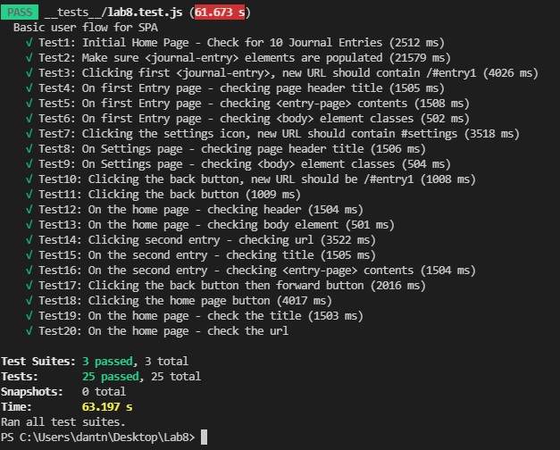

# Lab8_Starter

## Check your understanding q's (FILL OUT)
1. In your own words: Where would you fit your automated tests in your Bujo project development pipeline? (just write the letter)

    Within a Github action that runs whenever code is pushed 

2. Would you use a unit test to test the “message” feature of a messaging application? Why or why not? For this question, assume the “message” feature allows a user to write and send a message to another user.

    No, because there is a lot of variables in this test. What the message contains, message length, how the reciever gets the message from the user, etc. This is too big for a unit test.

3. Would you use a unit test to test the “max message length” feature of a messaging application? Why or why not? For this question, assume the “max message length” feature prevents the user from typing more than 80 characters

    Yes, this seems like a pretty small component to test with a really easy to understand outcome.

4. What do you expect to happen if we run our puppeteer tests with the field “headless” set to true?

    It would probably run the tests without a browser UI. This means it will go back to the original unit tests.

5. What would your beforeAll callback look like if you wanted to start from the settings page before every test case?

    await page.click('[src="./styles/settings.svg"]')

6. 
 